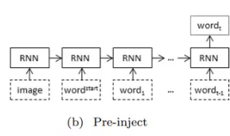
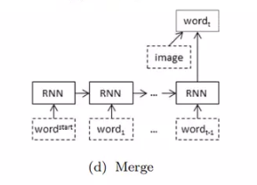

# Image-captioning-pytorch

## Overview

- Có thể dùng để gán nhãn cho ảnh
- Ứng dụng trong việc hỗ trợ người khiếm thị

## Idea

Bài toán có 2 nguồn dữ liệu đầu vào lúc huấn luyện. Thứ nhất là ảnh, thứ hai là caption của ảnh.

Với việc đầu vào của chúng ta là một cái ảnh, ta có thể nghĩ ngay đến việc dùng CNN để trích xuất ra những đặc trưng của ảnh. Đối với đầu vào là một câu văn bản, ta lại thường nghĩ đến dùng RNN thường thấy để xử lí chuỗi.

=> 2 cách cơ bản để input cho image captioning:

1. Injection Architecture

2. Merging Architecture

### 1. Injection Architecture

Chia ra làm loại chính:

- init-inject: thông thường, đầu vào của hidden state đầu tiên sẽ được khởi tạo là ma trận 0. Bây giờ ta thay ma trận đó bằng image.

    

- pre-inject: ảnh được xem như 1 từ đầu vào, có ý nghĩa tương tự như các từ khác trong câu token

    

- par-inject: mỗi $x_{t}$ đều là sự tồng hợp của ảnh và từ

    

### 2. Merging Architecture

## Đánh giá mô hình - BLEU scrore

BLEU socre định nghĩa thế nào là 1 mô tả tốt cho ảnh? Nó thể hiện trong hai yêu tố:

- Adequacy: mô tả đầy đủ thông tin trong ảnh
- Fluency: đúng ngữ pháp, cấu trúc câu

BLEU score (viết tắt của Bilingual Evaluation Understudy) được giới thiệu trong paper [BLEU: a Method for Automatic Evaluation of Machine Translation](https://www.aclweb.org/anthology/P02-1040.pdf)) . BLEU được thiết kế để sử dụng trong dịch máy (Machine Translation), đồng thời, phép đo này cũng được sử dụng trong các nhiệm vụ như tóm tắt văn bản, nhận dạng giọng nói, sinh nhãn ảnh (image captioning). Bên cạnh đó phép đo này cũng sử dụng để đánh giá chất lượng bản dịch của con người.

BLEU đánh giá một câu thông qua so khớp giữa câu đó và câu mẫu. Điểm được cho nằm trong khoảng 0 (sai hoàn toàn) đến 1 (khớp hoàn toàn).

Cách tính của BLEU là đếm số n-gram khớp nhau giữa câu mẫu (R) và câu được đánh giá (C) sau đó chia cho số token của C. Việc chọn n phụ thuộc vào ngôn ngữ, nhiệm vụ và mục tiêu cụ thể. Đơn giản nhất là unigram là n-gram chứa 1 token (n=1), bigram (n=2), trigram (n=3). Một cách trực quan, n càng lớn, câu văn càng mượt.

## Implementation

Google colab: [Image captioning](https://colab.research.google.com/drive/1Jt2LruyRfHwZP4fzaNcYpE6hg2PcA3ia)

Dataset: [Flickr8k Dataset](https://academictorrents.com/details/9dea07ba660a722ae1008c4c8afdd303b6f6e53b)

## References

[1] A Guide to Image Captioning: [https://viblo.asia/p/a-guide-to-image-captioning-part-1-gioi-thieu-bai-toan-sinh-mo-ta-cho-anh-gAm5yr88Kdb](https://viblo.asia/p/a-guide-to-image-captioning-part-1-gioi-thieu-bai-toan-sinh-mo-ta-cho-anh-gAm5yr88Kdb)

[2] Ứng dụng thêm mô tả cho ảnh (image captioning): [https://nttuan8.com/bai-15-ung-dung-them-mo-ta-cho-anh-image-captioning/](https://nttuan8.com/bai-15-ung-dung-them-mo-ta-cho-anh-image-captioning/)
